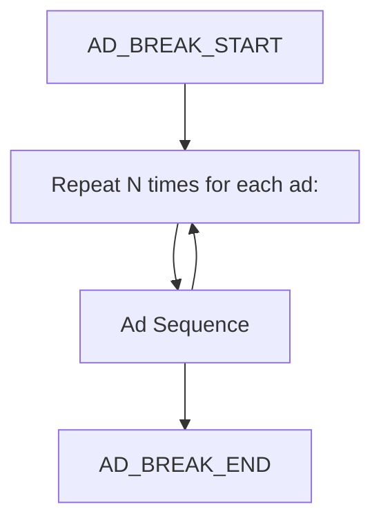
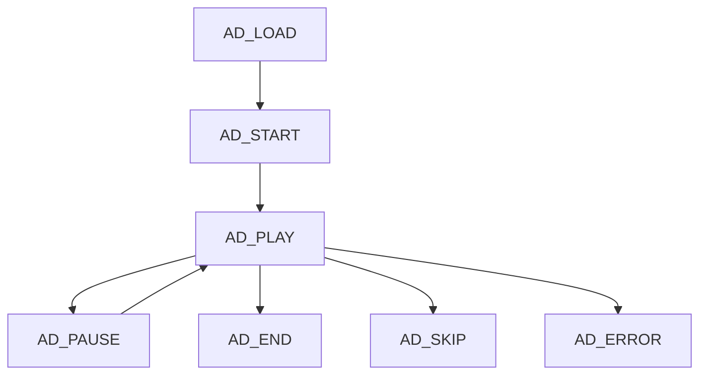

# Ad SDK Web

A lightweight web wrapper for Dailymotion's Ad SDK – load, manage, and interact with video ads easily in modern web players.

##  📘 Public API Documentation

### `async initialize(playerContainer: HTMLElement): Promise<void>`
Loads the external Ad SDK script and creates internal DOM elements for ad playback.

**Parameters:**

- `playerContainer`: `HTMLElement`
  The DOM element where the ad container will be mounted.

**Throws:**
If the container is missing or the script fails to load.

---

### `loadAdsSequence(appState: AppState): void`
Loads ads sequence with the required contextual information.
Susceptible to automatically starting a preroll.

**Parameters:**
- `appState`: `AppState`
  A structured object providing ad targeting and playback environment data.  
  👉 **See full structure below** or jump to [AppState](#AppState)

---

### `playAd(): void`
Starts ad playback.

**Throws:**  
If the SDK is not initialized.

---

### `pauseAd(): void`

Pauses the ad.

**Throws:**  
If the SDK is not initialized.

---

### `skipAd(): void`

Skips the currently playing ad.

**Throws:**  
If the SDK is not initialized.

---

### `getAdDetails(): AdDetails`

Returns detailed information about the currently playing ad.

**Returns:**  
An `AdDetails` object containing properties such as `position`, ad duration, and other metadata.

👉 **See full structure below** or jump to [AdDetails](#AdDetails)

---

### `on(event: AdEvents, callback: () => void): void`

Subscribes to a specific Ad SDK event.

**Parameters:**

- `event`: `AdEvents`  
  The event name to listen for.  
  👉 **See [`AdEvents`](#AdEvents) for available event names.**

- `callback`: `() => void`  
  The callback function to execute when the event occurs.

**Throws:**  
If the Ad SDK is not initialized.

---

### `off(event: AdEvents, callback: () => void): void`

Unsubscribes from a specific Ad SDK event.

**Parameters:**

- `event`: `AdEvents`  
  The event name to stop listening for.  
  👉 **See [`AdEvents`](#AdEvents) for available event names.**

- `callback`: `() => void`  
  The callback function to remove.

**Throws:**  
If the Ad SDK is not initialized.

---

### `updateAppState(appState: AppState): void`

Updates the SDK with a new state payload.

**Parameters:**

- `appState`: `AppState`  
  Updated app context data.
  👉 **See full structure below** or jump to [AppState](#AppState)

---
 

# Data structures

## AppState

| Parameter | Type | Required | Description |
| -------- | -------- | -------- | -------- |
| consent | Consent |  yes |  User consent and privacy settings relevant for ad personalization and legal compliance. |
| video | VideoState | yes | Current video playback state and characteristics affecting ad behavior. |
| environment | EnvironmentContext | yes | Context about the app environment, locale, and device details. |
| player | PlayerSettings | yes | Settings and references related to the video player instance. |
| metadata | Metadata | yes | Additional descriptive information about the video or stream used for ad decisioning. |

## Consent

| Parameter | Type | Required | Description |
| -------- | -------- | -------- | -------- |
| ccpaConsent | string |  yes |  User’s consent status under the California Consumer Privacy Act.    |
| tcfConsent | string |  yes    |  Consent string according to the IAB Transparency and Consent Framework (TCF). |
| isEnabledForTcf | boolean | yes |  Flag indicating if TCF enforcement is enabled for this user/session. |
| tcf2HasConsentForGoogle | boolean | yes | Whether consent has been given for Google in TCF v2 context. |
| tcf2HasConsentForDailymotion | boolean | yes | Whether consent has been given for Dailymotion in TCF v2 context. |
| isGdprApplicable | boolean |  yes | Indicates if GDPR regulations apply to the current user/session. |

## VideoState

| Parameter | Type | Required | Description |
| -------- | -------- | -------- | -------- |
| isAutoplay | boolean | yes | Whether the video is set to autoplay. |
| isLive | boolean | yes | Indicates if the video content is a live stream. |
| isCurrentTimeDVR | boolean | yes | Whether the current playback position is within a DVR window. |
| playedVideosCounter | number | yes | Count of videos played during the session/user lifecycle. |
| isVideoSeekable | boolean | yes | Whether the video player supports seeking functionality. |
| viewId | string | yes | Unique identifier for the video view or playback session. |

## EnvironmentContext

| Parameter | Type | Required | Description |
| -------- | -------- | -------- | -------- |
| appName | string | yes | Name of the app or website embedding the player. |
| locale | string |  yes | Locale or language setting for the user session. |
| topDomain | string | yes | The top-level domain of the page embedding the player. |
| embedder | string |  yes | Identifier or name of the embedding entity or partner. |
| clientType | string | yes | Type of client (e.g., web, mobile app, CTV). |
| deviceId | string | yes |  Unique identifier for the user’s device. |
| trafficSegment | number | yes | Numeric segment ID used for traffic or user segmentation. |
| v1st | string |  yes | A unique ID automatically assigned to your device by Dailymotion. |

## PlayerSettings

| Parameter | Type | Required | Description |
| -------- | -------- | -------- | -------- |
| videoTag | HTMLVideoElement | yes | Reference to the HTML video element. |
| isPlayerControlsEnabled | boolean | yes | Whether the player controls are enabled. |
| is3rdPartyCookiesAvailable | boolean |  yes | Indicates if third-party cookies are accessible in this context.|

## Metadata

| Parameter | Type | Required | Description |
| -------- | -------- | -------- | -------- |
| __typename | string | false | Indicates if the content is a "stream" or "live". |
| xid | string | false | Unique identifier for the video or content item. |
| title | string | false | Title of the video or content. |
| duration | number | false | Duration of the video content. |
| streamUrls | Object | false | 	URLs for different stream formats. |
| streamUrls.hls | string | false | 	HLS streaming URL. |
| isPasswordProtected | boolean | false | Indicates if the content is password protected. |
| visibility | string | false | Visibility status of the content (e.g., public, private). |
| creator | Object | false | Creator details of the content. |
| creator.xid | string | false | Unique identifier for the creator. |
| creator.name | string | false | Creator’s name. |
| creator.displayName | string | false | Creator’s full display name. |
| creator.shareUrls | Object | false | URLs used to share the creator’s profile or content. |
| creator.shareUrls.permalink | string | false | Permanent link to the creator’s profile or main page. |
| creator.avatar | Object |  false | Information about the creator’s avatar image. |
| creator.avatar.url | string | false | URL of the creator’s avatar image. |

 

# Internal data models

## AdDetails

| Parameter | Type | Description |
| -------- | -------- | -------- |
| skipOffset | number | Time in seconds after which the ad can be skipped. |
| duration | number | 	Total duration of the ad in seconds. |
| mediaFile | string | 	URL of the media file (video/audio) for the ad. |
| impressionTracker | string | URL used to track ad impressions (views). |
| midrollTime | number | Timestamp in the main content when a midroll ad should play. |
| position | 'preroll' \| 'midroll' \| 'postroll' | Indicates the ad position relative to the main content. |

## AdEvents

| Parameter | Description |
| -------- | -------- |
| AD_BREAK_START | Sent when the ad break has started |
| AD_BREAK_END | Sent when the ad break has ended |
| AD_LOAD | Sent when the ad has loaded |
| AD_START | Sent when the ad has started |
| AD_PLAY | Sent when the ad is played |
| AD_PAUSE | Sent when the ad is paused |
| AD_END | Sent when an ad has ended |
| AD_SKIP | Sent when the user click on the skip button |
| AD_ERROR | Sent when an error preventing to play an ad occurs |

 

## Events lifecycle

### Ad break sequence

### Ad sequence

